# 00 — System Design (visual)

This note is the visual companion to the numbered design documents. It does not replace them. Contracts, schemas, and failure rules live in [`01`](01-system-overview.md)–[`12`](12-testing-and-demo.md). This file shows how those pieces sit together.

ICAS is a computer-use runtime for legacy banking UIs that do not expose useful APIs. The model spends reasoning only while a workflow is unknown. A successful discovery compiles into a reusable capability. Production execution is deterministic.

```text
The model discovers.
The artifact becomes the reusable capability.
Replay executes the known capability.
```

Unless a diagram is marked **stretch** or **not done**, it describes the designed system. Implementation status is in [`TODO.md`](../TODO.md) and in [§8 Scope](#8-scope-map).

---

## 1. How to read this file

Each section is one concern: a short paragraph, one or two Mermaid diagrams, and a link to the detailed note. Shapes are a locked legend. Color is secondary; GitHub dark mode may wash fills. Shape plus label carry the meaning.

Do not treat a box as “implemented and demo-proven” unless §8 says so. Phase 8 still requires real discovery/replay artifacts; do not hand-author `capabilities/` to fake that proof.

### Shape legend

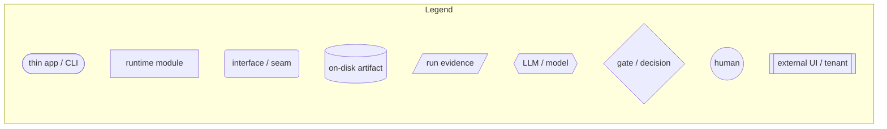

| Kind | Shape | Examples |
|---|---|---|
| Thin app / CLI | stadium | `icas-agent`, `icas-play`, `icas-adapt`, `icas-mcp` |
| Runtime module | rectangle | `ReplayEngine`, `CapabilityCompiler`, `PolicyGuard` |
| Interface / seam | rounded | `Surface`, `CapabilityRegistry` |
| On-disk artifact | cylinder | `capability.json`, tenant override |
| Run evidence | parallelogram | `trace.jsonl`, `log.jsonl`, screenshots |
| LLM / model | hexagon | `CandidateProposer`, `RepairProposer` |
| Gate / decision | diamond | `PolicyGuard`, locator found?, enrolled? |
| Human | circle | operator, CLI prompt, browser takeover |
| External UI | subroutine | `icas-bank`, `loki-bank`, headed browser |

Line and subgraph conventions:

- **solid** — must-have path
- **dashed** (`-.->`, dashed subgraph) — in-repo stretch (`--assist`, `icas-adapt`, MCP)
- **dotted** + `TODO` in the label — designed, not done (see §8)

---

## 2. System context

An operator runs ICAS against synthetic tenant apps. An agent host is an optional second caller through MCP. There is no production co-browsing console, no worker queue, and no real bank.

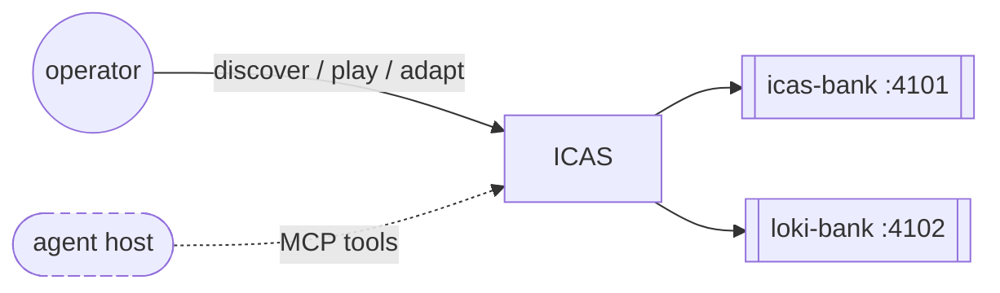

Both tenants are the same fictional Vendor+Product (`icas-bank` / `icas-bank`). Loki Bank is a second install with small label/nav drift, not a second product. See [`01-system-overview.md`](01-system-overview.md) and [`06-multi-tenant-and-adaptation.md`](06-multi-tenant-and-adaptation.md).

---

## 3. High-level architecture

Apps stay thin. Behavior lives in packages. The catalog is the join between authoring and execution. Replay never reads `capabilities/` itself; it receives an **effective** capability from `CapabilityResolver`. Playwright is the first `Surface` implementation, not the artifact model.

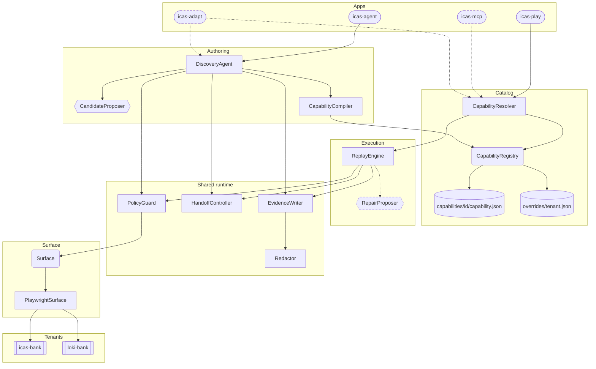

`FileSystemCapabilityRegistry({ root })` is the only catalog backend. The `CapabilityRegistry` interface stays; a REST/DB backend is out of scope. See [`02-repository-structure.md`](02-repository-structure.md).

---

## 4. Core invariant / lifecycle

Discovery always discovers. It does not silently replay. Replay selects by **capability id**. `--url` only opens the surface. Vendor, product, and tenant default to `icas-bank`; ICAS does not infer them from the URL.

First discover writes the Vendor+Product **base** and a **header-only** override for the discovering tenant (`overrides: {}`). Production replay (`icas-play` / MCP) fails if that tenant is not enrolled.

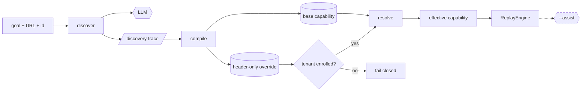

`icas-adapt` is a third lifecycle, not a second discover: guarded replay against another tenant, then header-only enrollment or a small declarative patch. See [§5.8](#58-multi-tenant--adapt).

---

## 5. Subsystems

### 5.1 Discovery and compiler

`icas-agent` observes the live surface, asks the model for ranked structured candidates, executes only what policy allows, and searches with an explicit ICAS-owned graph (budgets, backtrack, repeated-state). Mastra is the LLM/tool layer. Search state does not live in Mastra memory.

A capability is not a transcript. The compiler keeps the successful path only. Failed DFS branches stay evidence. Fill/select parameters are named by the proposer (`proposedInputParam`); the compiler aggregates them onto the artifact. Discover does not take typed invocation flags.

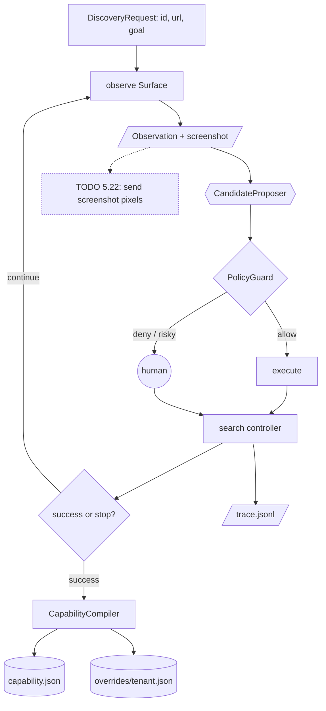

Vision-capable default is `openai/gpt-4o`. Today `generate` still embeds `imagePath` as text (Pass 5.22). Compile copies `error` and `hitl` `possibleOutcomes` onto the step and drops `kind: "success"` (Pass 5.19). Replay classification is Pass 4.14. Details: [`03-discovery-agent.md`](03-discovery-agent.md).

### 5.2 Catalog and resolve

Identity is catalog `id` only (for example `loan-payoff`). Vendor+Product is the app family. Tenant identity lives on the override, not on every route in the base.

Callers must not glob `capabilities/`. `@icas/capability` owns schema, validation, CRUD, overrides, and resolve.

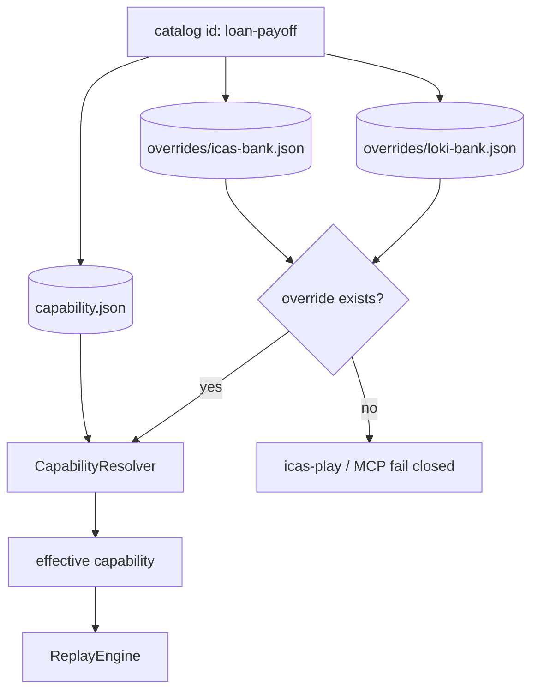

Header-only `overrides: {}` is valid enrollment. `ReplayEngine` stays tenant-agnostic: no tenant `if/else`, no hardcoded product error table. Details: [`04-capability-artifact.md`](04-capability-artifact.md).

### 5.3 Replay

`ReplayEngine` is the production path shared by `icas-play`, `icas-mcp`, and `icas-adapt` verification. Strict replay has no LLM. Every action still goes through `PolicyGuard`.

Result taxonomy: `success` | `business_outcome` | `failure`. Business outcomes are expected application answers, not crashes. Hard failures capture rich evidence and stop.

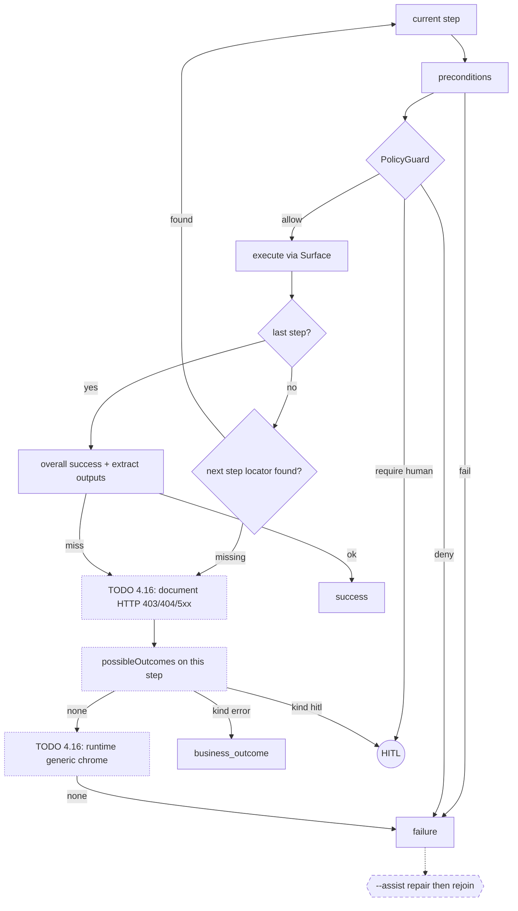

Until Passes 1.10 / 4.14 / 4.16 land, replay still uses the earlier hardcoded loan-copy table. Phrase embeddings (Pass 4.15) are deferred: same `match.phrases` field, no vectors on the artifact, still no LLM on strict replay. Details: [`05-replay-engine.md`](05-replay-engine.md).

### 5.4 Surface

The artifact speaks semantic actions, targets, assertions, and outputs. `PlaywrightSurface` is the implemented driver. Desktop/accessibility stays a future mapping behind the same seam; this prototype does not implement a second driver.

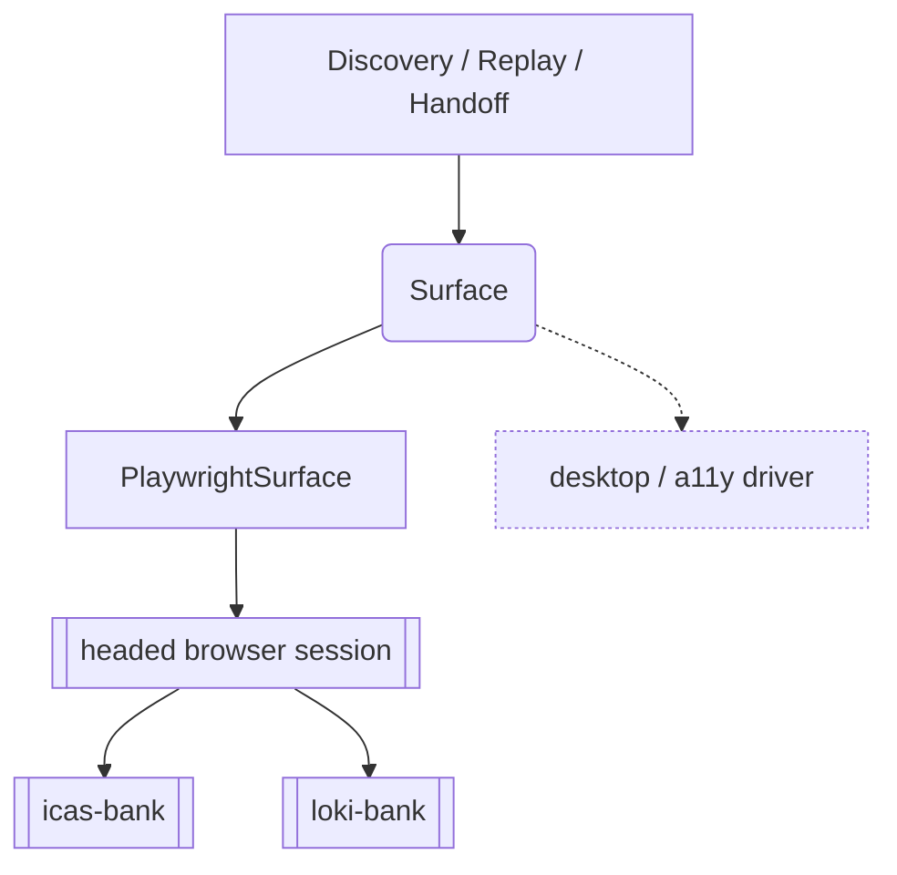

Target resolution is ranked: `roleText`, `visibleText`, `label`, then `relative` / `css` / `xpath`. Coordinates are last resort. HTTP status on `Observation` is Pass 2.10 (needed by replay 4.16). Details: [`10-surface-abstraction.md`](10-surface-abstraction.md).

### 5.5 Safety

Three independent layers. Prompt text influences what the model proposes. `PolicyGuard` enforces what may execute. `Redactor` controls what may leave memory or be persisted. Prompt policy is not enforcement.

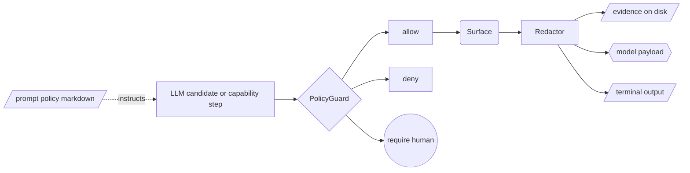

Runtime checks include action allowlist, in-origin vs off-origin (peek destination before click, then resulting navigation), and independent risky-control text (do not trust model self-classification). Saved artifacts must not contain credentials, tokens, or raw sensitive data. Details: [`08-safety-policy.md`](08-safety-policy.md).

### 5.6 Handoff

Handoff is control transfer of the **same** headed session. It is not a yes/no modal alone and not a co-browsing console.

Two forms: CLI approval/input, and browser takeover (human uses the existing Playwright window, then ENTER). Ownership is explicit: `automation` | `human`. Automation actions are rejected while a human owns the session.

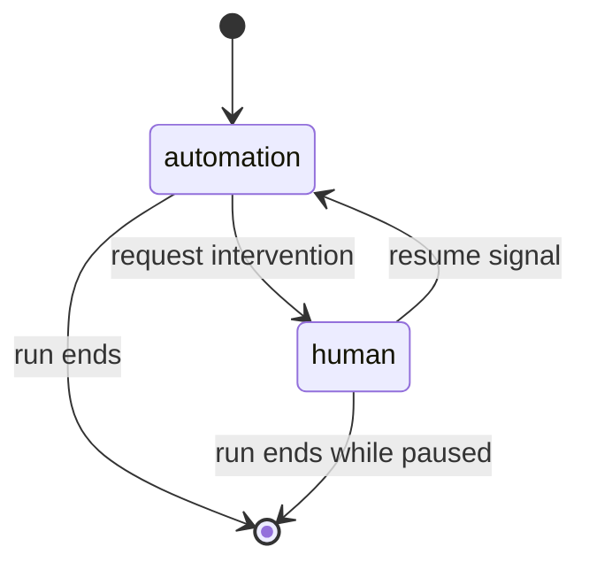

Discovery requests HITL when stuck, ambiguous, risky, or policy-blocked. Replay requests HITL when policy requires it, state is unrecoverable, assist is disabled/exhausted, or a compiled `possibleOutcomes` entry with `kind: "hitl"` matches. Details: [`07-human-handoff.md`](07-human-handoff.md).

### 5.7 Evidence

A capability is persistent knowledge. Every discovery, replay, or adaptation is a **run** with its own directory. Persist only after `Redactor`.

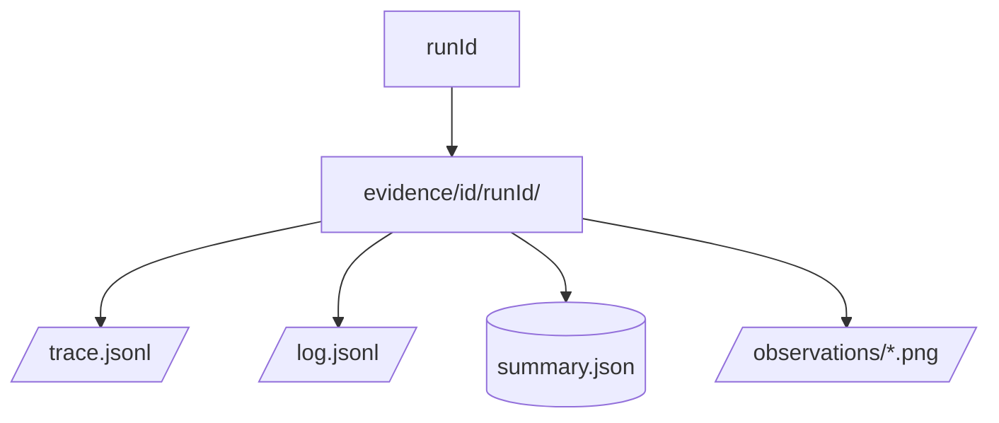

Discovery traces are the richest (observations, ranked candidates, policy, backtrack, intervention). Replay writes checkpoint JSONL on every terminal status; screenshots on failure, HITL, and business-outcome stops — not on success. Details: [`09-evidence-observability.md`](09-evidence-observability.md).

### 5.8 Multi-tenant / adapt

```text
Vendor → Product → Tenant
```

Same Vendor+Product is a reuse **hint**, not proof. `icas-adapt` runs guarded replay against a new tenant URL. Compatible → header-only override (`createdBy: "verified"`). Small drift → declarative patch (`createdBy: "icas-adapt"`) and re-verify. Large divergence → abort; do not accumulate a brittle patch. Rediscover is a separate `icas-agent` run, not a giant override.

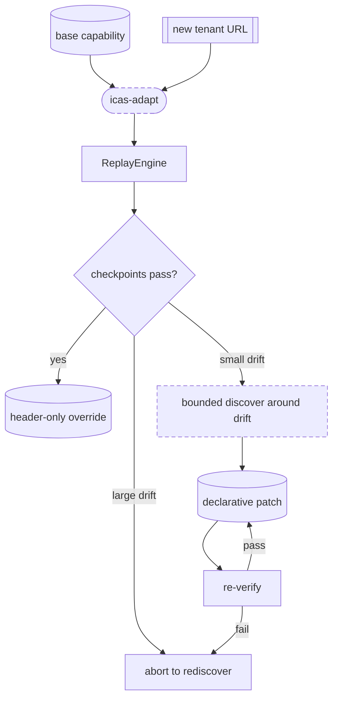

`icas-play` / MCP must not silently use the bare base for an unenrolled tenant. Details: [`06-multi-tenant-and-adaptation.md`](06-multi-tenant-and-adaptation.md).

### 5.9 MCP (stretch)

`icas-play` is the human CLI. `icas-mcp` is the agent-facing adapter over the **same** registry, resolver, and `ReplayEngine`. Stdio transport for the local demo. One tool per saved capability; typed args from compiled `inputs`. Tenant must already be enrolled (default `icas-bank`).

No separate MCP diagram: it is the dashed `icas-mcp` node on [§3](#3-high-level-architecture). Pass 6.13 still needs to surface `heading` / `summary` from a matched `possibleOutcomes` entry on `business_outcome`. Details: [`11-agent-facing-mcp.md`](11-agent-facing-mcp.md).

---

## 6. Cross-cutting sequences

### Discover (must)

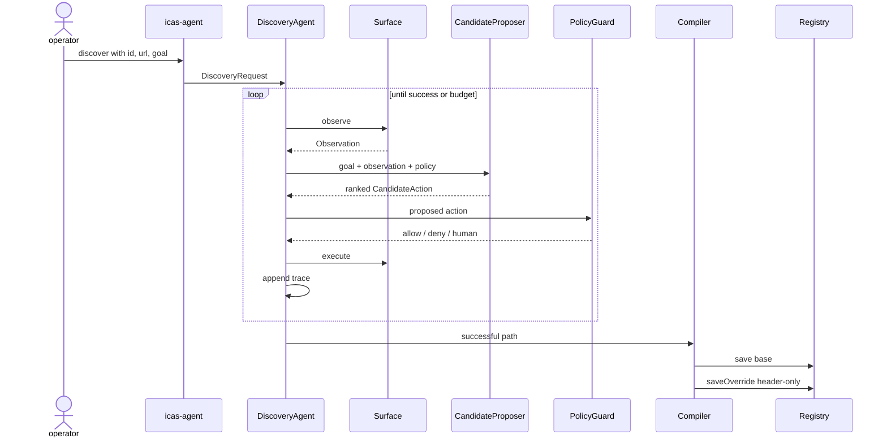

### Strict replay (must)

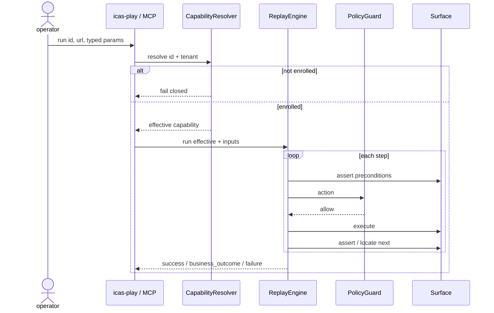

MCP follows the same replay sequence. The host supplies tool arguments instead of CLI flags.

### Adapt (stretch)

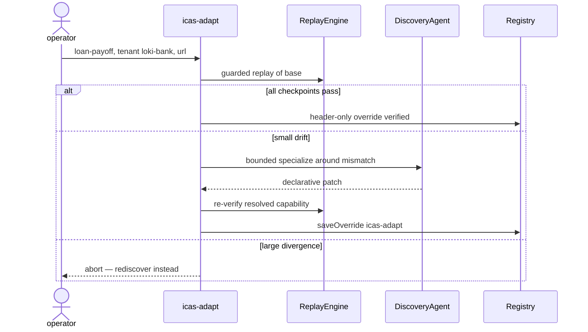

---

## 7. Package dependency direction

Dependencies flow inward toward reusable contracts. Core packages do not import CLIs.

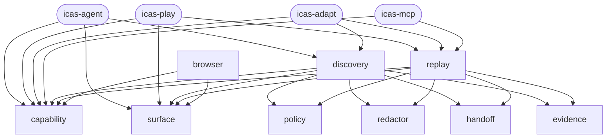

Workspace layout and naming: [`02-repository-structure.md`](02-repository-structure.md).

---

## 8. Scope map

The must-have slice is the vertical path a reviewer can defend: real LLM discovery, compiled artifact, enrolled tenant, deterministic replay with structured errors, same-session HITL, redacted evidence. Stretch is in-repo by design. Do not skip the must-have slice to polish extras.

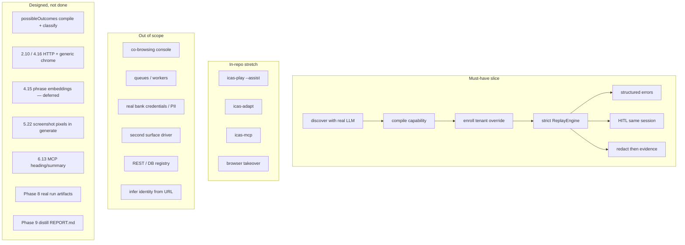

| Bucket | What | Notes |
|---|---|---|
| Must | Discover → artifact → enroll → replay + errors → HITL → evidence | [`01`](01-system-overview.md), Phases 1–5 and 6.1–6.5 |
| Stretch | `--assist`, `icas-adapt`, MCP, browser takeover | Built in-repo; draw dashed. MCP `business_outcome` copy still open (6.13) |
| Out | Co-browsing console, queues, real PII, desktop driver, REST/DB registry, URL inference | Keep the `Surface` and `CapabilityRegistry` seams; do not implement the extras |
| Remaining | HTTP status, vision pixels, Phase 8 evidence, `REPORT.md` | See [`TODO.md`](../TODO.md). Pass 4.15 is deferred on purpose |

Synthetic tenants `icas-bank` and `loki-bank` are in (Phase 7). The first concrete capability remains: generate a loan payoff statement for `loanAccountId` + `payoffDate`, extracting `totalPayoffAmount`, `principalBalance`, and `perDiemInterest`. Discovery must learn that path from the live UI; it must not hard-code it.

Reviewer-facing seven headings stay in [`REPORT.md`](../REPORT.md) (still a scaffold until Pass 9.1). Demo commands live in the root README; they must match a real run before Phase 8 is closed. Testing philosophy: [`12-testing-and-demo.md`](12-testing-and-demo.md).
