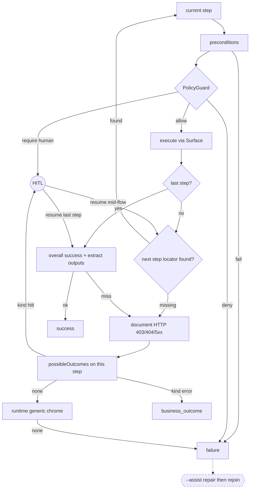

# 00 — System Design

ICAS is a computer-use runtime for legacy banking UIs that do not expose useful APIs. The model spends reasoning only while a workflow is unknown. A successful discovery compiles into a reusable capability. Production execution is deterministic.

```text
The model discovers.
The artifact becomes the reusable capability.
Replay executes the known capability.
```

Contracts and failure rules: `[01](01-system-overview.md)`–`[12](12-testing-and-demo.md)`. Implementation status: `[TODO.md](../TODO.md)`.

---

## 1. Architecture


An operator drives ICAS with `icas-agent` (discover), `icas-play` (replay), and `icas-adapt`. An agent host may invoke the same catalog through `icas-mcp`. There is no co-browsing console, worker queue, or real bank.

Discover and adapt write the `capabilities/` catalog. Replay and MCP read it through `CapabilityResolver` and never glob the tree. `ReplayEngine` receives only the **effective** capability. Every run writes `evidence/` (traces, logs, screenshots). Evidence is not an input to the next run.

Discover is the LLM path: `DiscoveryAgent` → `CandidateProposer` (Mastra) → the configured model (`ICAS_DISCOVERY_LLM_*`; default `openai/gpt-4o`). Search state stays in ICAS, not in Mastra memory. Strict replay has no LLM. `--assist` uses a separate `RepairProposer` and `ICAS_ASSIST_LLM_*`. `icas-adapt` mismatch patches use a `StepSpecializer` and `ICAS_ADAPT_LLM_*` (compatible enrollments skip the model). `.env` is model transport only (`MODEL`, `API_KEY`, optional `BASE_URL` and sampling).

`PlaywrightSurface` is the implemented `Surface`. It opens the synthetic tenants: `icas-bank` (`:4101`), `loki-bank` (`:4102`), `helix-cu` (`:4103`), and `icas-banc` (`:4104`). icas-bank, icas-banc, and Loki Bank share Vendor+Product `icas-bank` / `icas-bank`. icas-banc has one rename (Inquire → Look Up). Loki has broader label/nav drift. Helix CU is a different vendor/product (share hold).


| Component                      | Package / app                                                             |
| ------------------------------ | ------------------------------------------------------------------------- |
| Discover CLI                   | `apps/icas-agent`                                                         |
| Replay CLI                     | `apps/icas-play`                                                          |
| Adapt CLI                      | `apps/icas-adapt`                                                         |
| MCP server                     | `apps/icas-mcp`                                                           |
| Catalog, resolve               | `@icas/capability` (`FileSystemCapabilityRegistry`, `CapabilityResolver`) |
| Discover, compile              | `@icas/discovery` (`DiscoveryAgent`, `CapabilityCompiler`)                |
| Replay                         | `@icas/replay` (`ReplayEngine`)                                           |
| Policy, redact, HITL, evidence | `@icas/policy`, `@icas/redactor`, `@icas/handoff`, `@icas/evidence`       |
| Browser                        | `@icas/surface`, `@icas/browser`                                          |
| Tenants                        | `tenants/icas-bank`, `icas-banc`, `loki-bank`, `helix-cu`                  |


Prompt policy instructs the model. `PolicyGuard` enforces execute. `Redactor` runs before evidence is persisted. The catalog backend is `FileSystemCapabilityRegistry({ root })` only; REST/DB registries are out of scope.

Apps stay thin. Behavior lives in packages. Core packages do not import CLIs. See `[01-system-overview.md](01-system-overview.md)`, `[02-repository-structure.md](02-repository-structure.md)`, `[06-multi-tenant-and-adaptation.md](06-multi-tenant-and-adaptation.md)`.

---


## 2. Lifecycle

Discovery always discovers. It does not silently replay. Replay selects by **capability id**. `--url` only opens the surface. Vendor, product, and tenant default to `icas-bank`; ICAS does not infer them from the URL.

First discover writes the Vendor+Product **base** and a **header-only** override for the discovering tenant (`overrides: {}`). Production replay (`icas-play` / MCP) fails if that tenant is not enrolled.

`icas-adapt` is a third lifecycle, not a second discover: guarded replay against another tenant, then header-only enrollment or a small declarative patch. See [§3.8](#38-multi-tenant--adapt).

---


## 3. Subsystems


### 3.1 Discovery and compiler

`icas-agent` observes the live surface, asks the model for ranked structured candidates, executes only what policy allows, and searches with an explicit ICAS-owned graph (budgets, backtrack, repeated-state). Mastra is the LLM/tool layer. Search state does not live in Mastra memory.

A capability is not a transcript. The compiler keeps the successful path only. Failed DFS branches stay evidence. Fill/select parameters are named by the proposer (`proposedInputParam`); the compiler aggregates them onto the artifact. Discover does not take typed invocation flags.

Vision-capable default is `openai/gpt-4o`. Today `generate` still embeds `imagePath` as text (Pass 5.22). Compile copies `error` and `hitl` `possibleOutcomes` onto the step and drops `kind: "success"`. Details: `[03-discovery-agent.md](03-discovery-agent.md)`.

### 3.2 Catalog and resolve

Identity is catalog `id` only (for example `loan-payoff`). Vendor+Product is the app family. Tenant identity lives on the override, not on every route in the base.

Callers must not glob `capabilities/`. `@icas/capability` owns schema, validation, CRUD, overrides, and resolve. Header-only `overrides: {}` is valid enrollment. `ReplayEngine` stays tenant-agnostic: no tenant `if/else`, no hardcoded product error table. Details: `[04-capability-artifact.md](04-capability-artifact.md)`.

### 3.3 Replay

`ReplayEngine` is the production path shared by `icas-play`, `icas-mcp`, and `icas-adapt` verification. Strict replay has no LLM. Every action still goes through `PolicyGuard`.

Result taxonomy: `success` | `business_outcome` | `failure`. Business outcomes are expected application answers, not crashes. Hard failures capture rich evidence and stop.



Last-step HITL resume re-checks overall success once. Mid-flow resume re-probes the next locator. Phrase embeddings (Pass 4.15) are deferred: same `match.phrases` field, no vectors on the artifact, still no LLM on strict replay. Details: `[05-replay-engine.md](05-replay-engine.md)`.

### 3.4 Surface

The artifact speaks semantic actions, targets, assertions, and outputs. `PlaywrightSurface` is the implemented driver. Desktop/accessibility stays a future mapping behind the same seam; this prototype does not implement a second driver.

Target resolution is ranked: `roleText`, `visibleText`, `label`, then `relative` / `css` / `xpath`. Coordinates are last resort. Details: `[10-surface-abstraction.md](10-surface-abstraction.md)`.

### 3.5 Safety

Three independent layers. Prompt text influences what the model proposes. `PolicyGuard` enforces what may execute. `Redactor` controls what may leave memory or be persisted. Prompt policy is not enforcement.

Runtime checks include action allowlist, in-origin vs off-origin, and independent risky-control text. Saved artifacts must not contain credentials, tokens, or raw sensitive data. Details: `[08-safety-policy.md](08-safety-policy.md)`.

### 3.6 Handoff

Handoff is control transfer of the **same** headed session. It is not a yes/no modal alone and not a co-browsing console.

Two forms: CLI approval/input, and browser takeover of the existing Playwright window. Ownership is `automation` | `human`. Automation actions are rejected while a human owns the session. Details: `[07-human-handoff.md](07-human-handoff.md)`.

### 3.7 Evidence

A capability is persistent knowledge. Every discovery, replay, or adaptation is a **run** under `evidence/<id>/<runId>/`. Persist only after `Redactor`.

Discovery traces are the richest. Replay writes checkpoint JSONL on every terminal status; screenshots on failure, HITL, and business-outcome stops — not on success. Details: `[09-evidence-observability.md](09-evidence-observability.md)`.

### 3.8 Multi-tenant / adapt

```text
Vendor → Product → Tenant
```

Same Vendor+Product is a reuse **hint**, not proof. `icas-adapt` runs guarded replay against a new tenant URL. Compatible → header-only override (`createdBy: "verified"`) with no LLM. Small drift → one `StepSpecializer` generate (`ICAS_ADAPT_LLM_`*) writes a declarative one-step patch (`createdBy: "icas-adapt"`) and re-verify with `ReplayEngine` (still no LLM). Large divergence → abort; do not accumulate a brittle patch. Rediscover is a separate `icas-agent` run, not a giant override.

`icas-play` / MCP must not silently use the bare base for an unenrolled tenant. Details: `[06-multi-tenant-and-adaptation.md](06-multi-tenant-and-adaptation.md)`.

### 3.9 MCP

`icas-play` is the human CLI. `icas-mcp` is the agent-facing adapter over the **same** registry, resolver, and `ReplayEngine`. Stdio transport for the local demo. One tool per saved capability; typed args from compiled `inputs`. Tenant must already be enrolled (default `icas-bank`). Details: `[11-agent-facing-mcp.md](11-agent-facing-mcp.md)`.

---


## 4. Scope

The system implements real LLM discovery, compiled artifact, enrolled tenant, deterministic replay with structured errors, same-session HITL, and redacted evidence. `--assist`, `icas-adapt`, MCP, and browser takeover are in-repo.


| Bucket    | What                                                                                   | Notes                                                 |
| --------- | -------------------------------------------------------------------------------------- | ----------------------------------------------------- |
| Must      | Discover → artifact → enroll → replay + errors → HITL → evidence                       | `[01](01-system-overview.md)`, Phases 1–5 and 6.1–6.5 |
| Stretch   | `--assist`, `icas-adapt`, MCP, browser takeover                                        | Built in-repo                                         |
| Out       | Co-browsing console, queues, real PII, desktop driver, REST/DB registry, URL inference | Keep the `Surface` and `CapabilityRegistry` seams     |
| Remaining | vision pixels (5.22), phrase embeddings (4.15, deferred)                               | `[TODO.md](../TODO.md)`                               |


Synthetic tenants `icas-bank`, `icas-banc`, `loki-bank`, and `helix-cu` are in (Phase 7). The first concrete capability is a loan payoff statement. Discovery names the compiled inputs; live `loan-payoff` uses `loanAccountNumber` and `payoffDate` (see `icas-play describe`), not the sketch name `loanAccountId`. Outputs include `totalPayoffAmount`, `principalBalance`, and `perDiemInterest`. Helix CU is a second product (share hold). Discovery learns each path from the live UI; it must not hard-code it.

Seven-heading write-up: `[REPORT.md](../REPORT.md)`. Demo commands: root README. Testing: `[12-testing-and-demo.md](12-testing-and-demo.md)`.